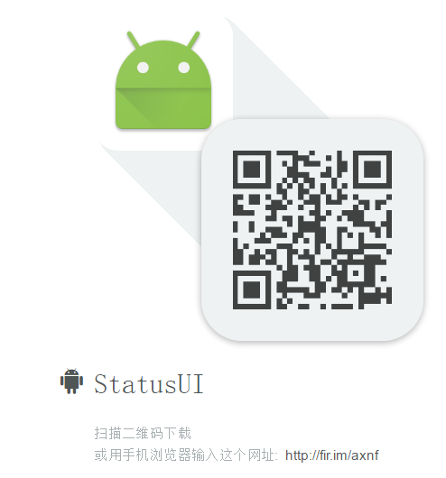

StatusUIManager:  界面状态管理（loading，数据空，服务器出错，网络出错，数据解析出错....）
===================================================


demo：



=============================

截图：


==============================

## 1 这是什么？

* 此乃何物
    * 一个页面从开始请求数据到请求有了结果之后，有多种状态UI切换
    * 这个小library就是让你方便的控制这些状态的显示样式，显示和隐藏
    * 并且所有状态和UI都是可配置的
    * 并且不侵入你原始的布局，完全以组件的形式提供
    * 并且要求低，只要求你的content view外面包一层FrameLayout
    * 并且使用简单，你只需要定义自己的status和显示样式，并且还内置了几个常见的状态和布局

## 2 怎么用？

### 1 状态定制，默认的状态在DefaultStatus里

```java
public class DefaultStatus {
    public static final String STATUS_LOADING = "loading";
    public static final String STATUS_EMPTY = "empty";
    public static final String STATUS_NETOFF = "netoff";
    public static final String STATUS_SERVER_ERROR = "server-error";
    public static final String STATUS_LOGIC_FAIL = "logic-fail";
    public static final String STATUS_lOCAL_ERROR = "local-error";
}

反正就是个字符串常量，你在哪儿都可以自己定义

```

### 2 给各个状态配置不同UI，对应默认状态的UI都在DefaultStatusProvider


```java
//STATUS_LOADING：正在加载
DefaultStatusProvider.DefaultLoadingStatusView

///STATUS_EMPTY：数据为空，一般用在列表页
DefaultStatusProvider.DefaultEmptyStatusView

//STATUS_NETOFF：没网了
DefaultStatusProvider.DefaultNetOffStatusView

//STATUS_SERVER_ERROR： 服务器出问题了，生产环境是可能出这个问题的
DefaultStatusProvider.DefaultServerErrorStatusView

//STATUS_LOGIC_FAIL：请求本身没有问题，但业务逻辑有问题，例如注册用户时，用户名重复，一般都会带个业务code
DefaultStatusProvider.DefaultLogicFailStatusView

//STATUS_lOCAL_ERROR：请求本身没有问题，但处理数据时出异常了，虽然是手机端代码的问题，但大多数是服务器json给的不规范
DefaultStatusProvider.DefaultLocalErrorStatusView
```

StatusProvider到底怎么回事？
```java
StatusProvider(Context context, String status, View contentView, OnStatusViewCreateCallback callback)
意思就是状态提供者，名字取的不太合适，应该是状态UI提供者

参数2：对应哪个status
参数3：内容View，即正常数据的View，必须包在一个FrameLayout里
参数3：callback，状态UI初始化之后，可以做一些样式设置，事件设置等
```

### 3 控制显示状态UI和内容UI

```java
statusUIManager.show(String status) //显示对应状态UI
statusUIManager.clearStatus()   //显示内容UI

statusUIManager里其实是一个map，存储了所有你设置的StatusProvider
```

```java
一般代码如下：
private void initStatusUI(){
    statusUIManager = new StatusUIManager();

    statusUIManager.addStatusProvider(
            new DefaultStatusProvider.DefaultLoadingStatusView(
                    getActivity(),
                    DefaultStatus.STATUS_LOADING,
                    content,
                    new StatusProvider.OnStatusViewCreateCallback() {
        @Override
        public void onCreate(int status, View statusView) {

        }
    }));

    statusUIManager.addStatusProvider(
            new DefaultStatusProvider.DefaultEmptyStatusView(getActivity(),
                    DefaultStatus.STATUS_EMPTY,
                    content,
                    new StatusProvider.OnStatusViewCreateCallback() {
        @Override
        public void onCreate(int status, View statusView) {

        }
    }));

    statusUIManager.addStatusProvider(D
            new DefaultStatusProvider.DefaultServerErrorStatusView(
                    getActivity(),
                    DefaultStatus.STATUS_SERVER_ERROR,
                    content,
                    new StatusProvider.OnStatusViewCreateCallback() {
        @Override
        public void onCreate(int status, View statusView) {

        }
    }));

    statusUIManager.addStatusProvider(
            new DefaultStatusProvider.DefaultLogicFailStatusView(getActivity(),
                    DefaultStatus.STATUS_LOGIC_FAIL,
                    content,
                    new StatusProvider.OnStatusViewCreateCallback() {
        @Override
        public void onCreate(int status, View statusView) {

        }
    }));

    statusUIManager.addStatusProvider(
            new DefaultStatusProvider.DefaultNetOffStatusView(
                    getActivity(),
                    DefaultStatus.STATUS_NETOFF,
                    content,
                    new StatusProvider.OnStatusViewCreateCallback() {
        @Override
        public void onCreate(int status, View statusView) {

        }
    }));

    statusUIManager.addStatusProvider(
            new DefaultStatusProvider.DefaultLocalErrorStatusView(
                    getActivity(),
                    DefaultStatus.STATUS_lOCAL_ERROR,
                    content,
                    new StatusProvider.OnStatusViewCreateCallback() {
        @Override
        public void onCreate(int status, View statusView) {

        }
    }));

}


```

